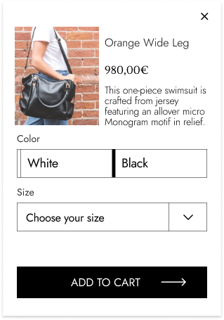
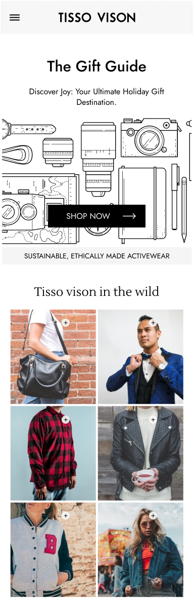

<h1 align="center">
  Shopify Store Project 
</h1>
 
<h1 align="center">
  Desktop 
</h1>

  

<h1 align="center">
  Product ShowCase 
</h1>

  

<h1 align="center">
  Mobile 
</h1>

  

## TL;DR

You can fork this repo to modify and make changes of your own. Please give me proper credit. Thanks!

## This Project was Built in 6 Days!

## Built With

Shopify Store Project for Clothes Brand with Two Pages/Section. 

This project was built using these technologies.

- HTML
- CSS / SCSS
- BootStrap
- JS
- API

## Features
  👾 Optimized for all Devices

**📖 Shopify Add to Cart Functionality**

**🎨 Styled with Images as well**

**📱 Fully Responsive Up-to 4k!**

## Getting Started

Clone down this repository. You will need `node.js` and `git` installed globally on your machine.

### Show your support

Give a ⭐ if you like this website!
